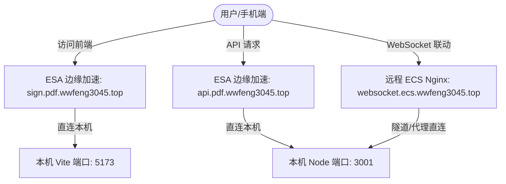

# PDF 在线签名系统 - 部署与运行环境记忆库 (Gemini Memory)

本文件由 AI 助手自动生成并持久化于项目根目录下，用于记录该项目的真实生产部署与边缘加速（ESA）架构，避免每次开启新会话时重复输入。

---

## 1. 基础路径与工作目录
*   **项目根目录**: `/mnt/raid/pdfsign`
*   **前端目录**: `/mnt/raid/pdfsign/client`
*   **后端目录**: `/mnt/raid/pdfsign/server`
*   **上传文件暂存区**: `/mnt/raid/pdfsign/uploads`

---

## 2. 真实架构与网络拓扑

本项目**没有使用本机的 Nginx** 进行流量分发，而是采用了一种基于**边缘加速（ESA）与远程 ECS 隔离代理**的三域名分离架构，以解决 CDN/ESA 的连接时效性冲突及 WebSocket 握手限制：



### 2.1 域名与端口映射表
| 域名 | 用途 | 加速/反代方式 | 映射到本机端口 |
| :--- | :--- | :--- | :--- |
| **`sign.pdf.wwfeng3045.top`** | 前端页面访问 | **ESA (边缘安全加速)** 直连 | 本机 **`5173`** 端口 (`pdf-frontend` Vite Dev Server) |
| **`api.pdf.wwfeng3045.top`** | 后端 API 服务 | **ESA (边缘安全加速)** 直连 | 本机 **`3001`** 端口 (`pdf-backend` Express) |
| **`websocket.ecs.wwfeng3045.top`** | 跨端扫码联动 WebSocket | **远程 ECS Nginx** 反向代理 | 本机 **`3001`** 端口 (`pdf-backend` Socket.io) |

### 2.2 远程代理服务器信息
*   **远程服务器地址**: `ecs.wwfeng3045.top`
*   **登录用户名**: `root`
*   **作用**: 运行 Nginx 作为独立未加速的 WebSocket 通道，防止长连接被边缘加速服务（ESA）拦截或超时断开。

---

## 3. 本机 PM2 进程管理
项目使用本机 PM2 常驻管理前端和后端两个 Node.js 进程：

*   **进程状态查询**: `pm2 list`

### 3.1 后端服务 (`pdf-backend`)
*   **工作目录**: `/mnt/raid/pdfsign/server`
*   **启动方式**: `npm run dev` (映射到 `ts-node-dev --respawn src/index.ts`)
*   **监听端口**: `3001`（已支持 IPv4/IPv6 双栈监听 `::`）
*   **日志路径**:
    *   输出日志: `/home/wwf/.pm2/logs/pdf-backend-out.log`
    *   错误日志: `/home/wwf/.pm2/logs/pdf-backend-error.log`

### 3.2 前端服务 (`pdf-frontend`)
*   **工作目录**: `/mnt/raid/pdfsign/client`
*   **启动方式**: `npm run dev -- --host`（Vite 开发服务器）
*   **监听端口**: `5173`（配合 `--host` 允许外部 ESA 直接连接）
*   **日志路径**:
    *   输出日志: `/home/wwf/.pm2/logs/pdf-frontend-out.log`
    *   错误日志: `/home/wwf/.pm2/logs/pdf-frontend-error.log`

---

## 4. 常用服务维护命令

### 4.1 重启本地服务
```bash
# 重启后端 Express
pm2 restart pdf-backend

# 重启前端 Vite
pm2 restart pdf-frontend

# 一键重启所有
pm2 restart all
```

### 4.2 查看本地实时日志
```bash
# 查看后端日志
pm2 logs pdf-backend

# 查看前端日志
pm2 logs pdf-frontend
```

### 4.3 远程 ECS Nginx 管理 (需 SSH 登录到 ecs.wwfeng3045.top 运行)
```bash
# 登录远程服务器
ssh root@ecs.wwfeng3045.top

# 测试 Nginx 语法
nginx -t

# 重新加载远程 Nginx 配置
systemctl reload nginx
```
